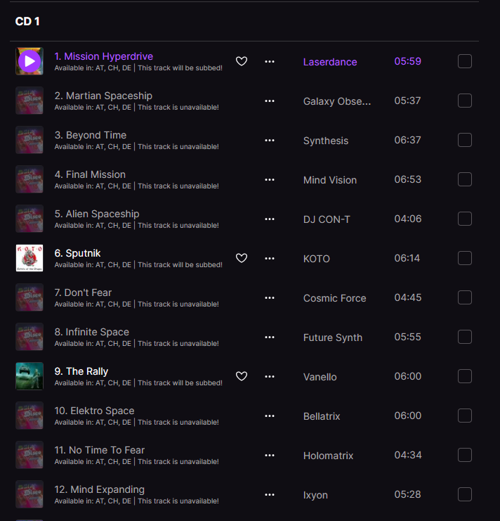
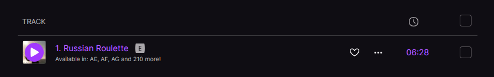

# deezer-display-availability

Deezer UserScript to display whether a track will be subbed from another release and the countries where the track is available.

> [!WARNING]
> This UserScript sends a request per each track in the album to https://api.deezer.com. This is the same reason why the script uses the `context-menu` runner.  
> DO NOT cry after you get ip banned, lol.

## Usage

1. Install UserScript by copy pasting the contents in [`deezer-display-availability.user.js`](./deezer-display-availability.user.js) to a UserScript engine.
2. Enable the script.
3. Navigate to a url starting with `https://deezer.com/{code}/album/{id}`.
4. Open the UserScript engine context menu by right clicking on the page.
5. Click on `deezer-display-availability`
6. Profit!!!

## Additional notes

You can right click on the availability line to get the whole list of available countries whenever the line is truncated.

## Screenshots

1. Multi CD releases
   

2. Single releases
   
